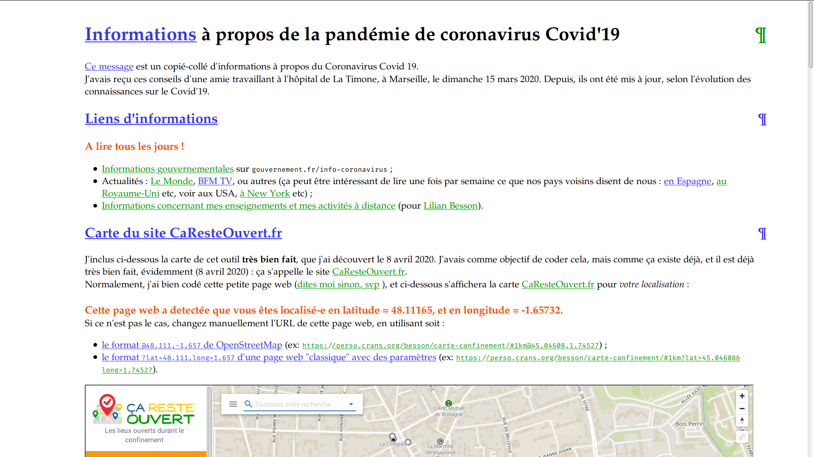
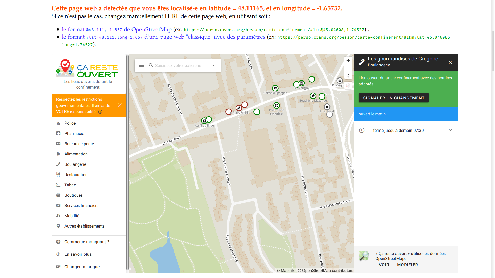
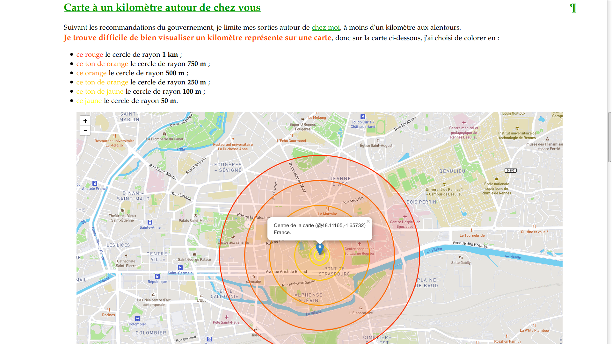
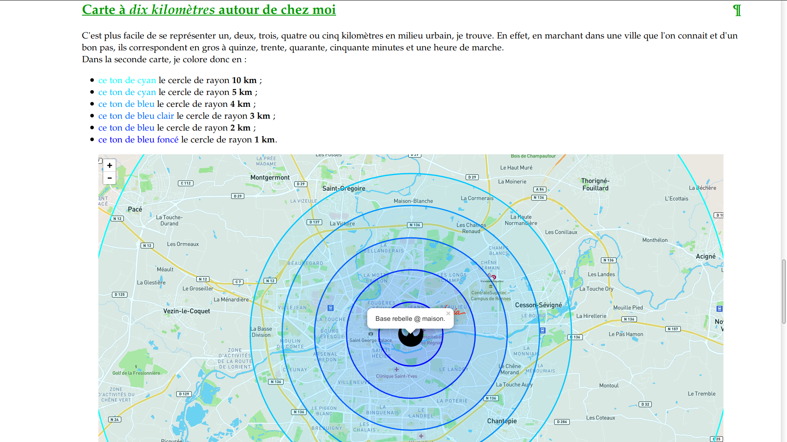
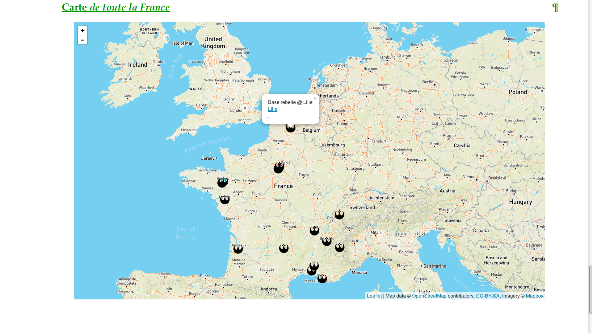

# [« Rennes en Résilience »](https://rennesenresilience.home.blog/) : carte des commerces fermés et ouverts autour de chez moi

Allez voir [cette page là](carte.html) ([`carte.html`](carte.html)) pour le code source.
Et pour utiliser la carte, elle est hébergée sur :

- Sur [le site <code>Rennes-en-Resilience.GitHub.io</code>](https://rennes-en-resilience.github.io/Cartes/carte.html)
- Et aussi sur [mon site <code>perso</code>](https://perso.crans.org/besson/Rennes-en-Resilience/carte/carte.html?lat=48.0900364&long=-1.6286437)

## Exemples

- [Informations à propos de la pandémie de coronavirus Covid'19](https://perso.crans.org/besson/carte-confinement/#informations)
- [Carte du site CaResteOuvert.fr](https://perso.crans.org/besson/carte-confinement/index.html#caresteouvert.html)
- [Carte à un kilomètre autour de chez vous](https://perso.crans.org/besson/carte-confinement/index.html#1km.html)
- [Carte à dix kilomètres autour de chez vous](https://perso.crans.org/besson/carte-confinement/index.html#10km.html)
- [Carte de toute la France métropolitaine](https://perso.crans.org/besson/carte-confinement/index.html#france.html)

---

## Capture d'écrans

### Informations génériques sur la pandémie

### Carte du site `<http://CaResteOuvert.fr/>`_

### Carte centrée avec un rayon d'un kilomètre

### Carte centrée avec un rayon de dix kilomètres

### Carte de toute la France

---

## Pages contenant juste une des cartes

- [Carte du site CaResteOuvert.fr](https://perso.crans.org/besson/carte-confinement/caresteouvert.html)
- [Carte à un kilomètre autour de chez vous](https://perso.crans.org/besson/carte-confinement/carte1km.html)
- [Carte à dix kilomètres autour de chez vous](https://perso.crans.org/besson/carte-confinement/carte10km.html)
- [Carte de toute la France métropolitaine](https://perso.crans.org/besson/carte-confinement/carteFrance.html)

----

## :scroll: Licence ? 
Ce dépôt git et tous les fichiers contenus sont publiés librement sous les termes de la [Licence MIT](https://lbesson.mit-license.org/) (voir le fichier [LICENSE](LICENSE)).
© [Lilian Besson](https://GitHub.com/Naereen) et d'autres collaborateurs et collaboratrices, 2020.

